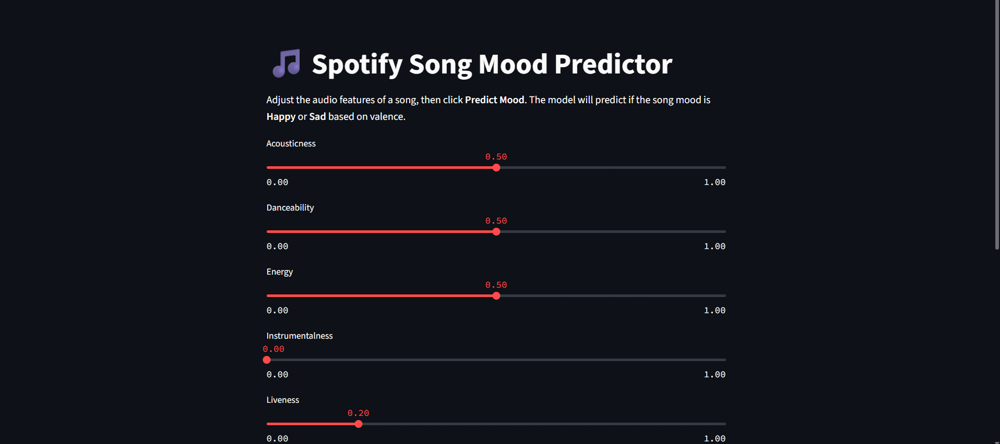
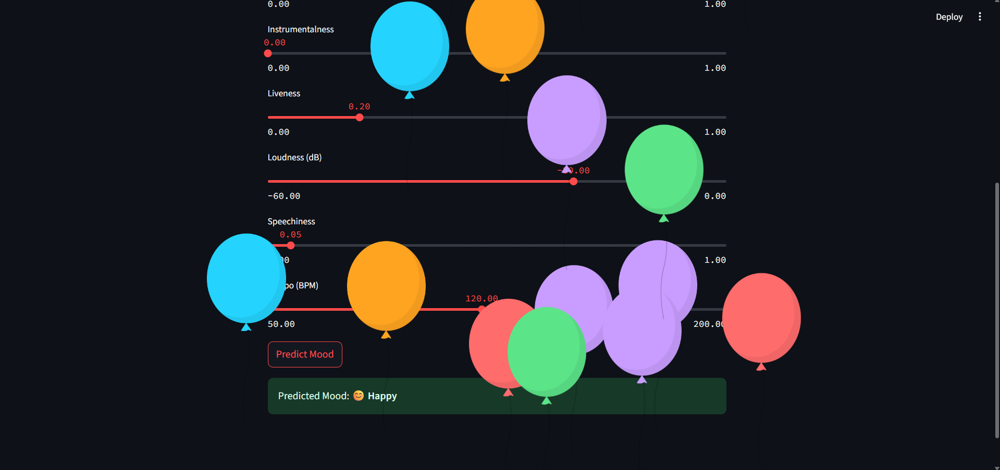

# 🎵 Spotify Music Mood Predictor 😊😢

Predict the mood of a song — **Happy** or **Sad** — using audio features from Spotify’s dataset.  
This project includes a machine learning model trained on song attributes and a Streamlit app for interactive mood prediction.

---

## 📁 Project Files

- **`train_music_model.ipynb`**  
  Jupyter Notebook for data analysis, visualization, training a Logistic Regression model, and saving the model file.

- **`streamlit_music.py`**  
  Streamlit app that loads the trained model and predicts song mood based on user input features.

- **`data.csv`**  
  Spotify audio features dataset (must be placed in the project folder).

- **`model_predicted.pkl`**  
  Serialized trained model generated by the notebook.

---

## 🚀 Getting Started

### 1. Train the Model

Open `train_music_model.ipynb` in Jupyter Notebook or JupyterLab.

Run all cells to:
- Load and preprocess data  
- Visualize mood distribution and correlations  
- Train the model and evaluate performance  
- Save the model as `model_predicted.pkl`

---

### 2. Run the Streamlit App

Make sure you have Streamlit installed:

```bash
pip install streamlit
```

Start the app with:

```bash
streamlit run streamlit_music.py
```

Use the sliders to adjust audio features and click **Predict Mood** to see if the song is Happy or Sad.

---

## 📸 Screenshot of the App


### 2.



---


## 🔍 Features Used for Prediction

- `acousticness`
- `danceability`
- `energy`
- `instrumentalness`
- `liveness`
- `loudness`
- `speechiness`
- `tempo`

> Mood is derived from the `valence` column:  
> Songs with valence ≥ 0.5 are labeled **Happy (1)**, otherwise **Sad (0)**.

---

## 📊 Visualizations (in Notebook)

- 🎭 Mood distribution (Happy vs Sad)  
- 🔥 Feature correlation heatmap  
- ✅ Confusion matrix  
- 📈 Classification report (Precision, Recall, F1)

---

## 🛠️ Requirements

- Python 3.x  
- pandas  
- seaborn  
- matplotlib  
- scikit-learn  
- joblib  
- streamlit


---

## 🤝 Contributing

Contributions, ideas, and pull requests are welcome!

---

## 📬 Contact

Made with ❤️ by Divyansh Kaul

---
